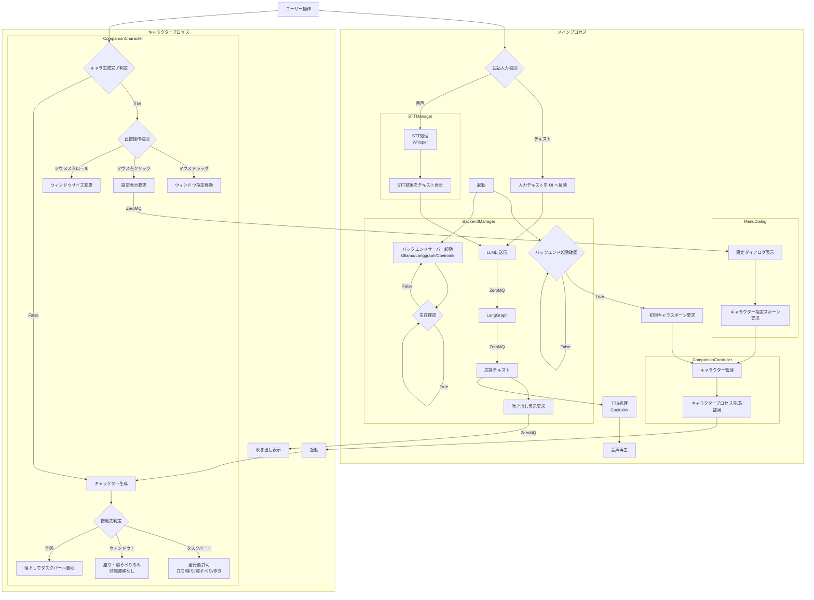
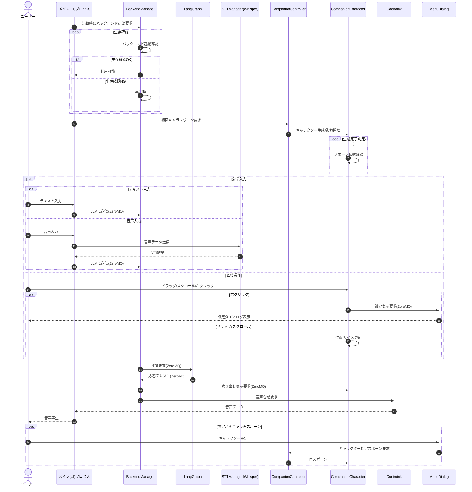

# システム設計（完成図ベース）

## フローチャート（目標構成）

```mermaid
flowchart TD
    U[ユーザー操作] --> CHAT_IN{会話入力種別}
    U --> SPWN_CHECK

    subgraph メインプロセス
        subgraph MenuDialog
            SETTING[設定ダイアログ表示]
            SETTING --> REQSPWN[キャラクター指定スポーン要求]
        end

        BOOTMAIN[起動]-->CHECKBACK{バックエンド起動確認}
        CHECKBACK -- True --> FRSTSPWN
        CHECKBACK -- False --> CHECKBACK
        FRSTSPWN[初回キャラスポーン要求] --> CHRCTRL
        BOOTMAIN --> BOOTBACK

        subgraph BackendManager
            BOOTBACK[バックエンドサーバー起動<br/>Ollama/Langgraph/Coeiroink] --> HRTBEAT
            HRTBEAT{生存確認} -- True --> HRTBEAT
            HRTBEAT -- False --> BOOTBACK
            SEND[LLMに送信] -- ZeroMQ --> AGENT[LangGraph]
            AGENT -- ZeroMQ --> RESP[応答テキスト]
            RESP --> REQBBL[吹き出し表示要求]
            CHECKBACK{バックエンド起動確認}
        end

        CHAT_IN -->|テキスト| TX[入力テキストを UI へ反映]
        CHAT_IN -->|音声| STT

        subgraph STTManager
            STT[STT処理<br/>Whisper] --> STTRES[STT結果をテキスト表示]
        end

        TX --> SEND
        STTRES --> SEND
        
        RESP --> TTS[TTS処理<br/>Coeiroink]
        TTS --> AUDIO[音声再生]

        subgraph CompanionController
            CHRCTRL[キャラクター管理]
            CHRCTRL --> CHARPROC[キャラクタープロセス生成/監視]
        end
        
        REQSPWN --> CHRCTRL 
    end

    subgraph キャラクタープロセス
        CHARPROC --> BOOTCHR
        BOOTCHR[起動] --> SPAWN

        subgraph CompanionCharacter
        SPAWN[キャラクター生成]
        SPAWN --> RULE{接地先判定}
        SPWN_CHECK{キャラ生成完了判定} -- True --> OP_IN{直接操作種別}
        SPWN_CHECK -- False --> SPAWN

        RULE -->|タスクバー上| ACT1[全行動許可<br/>立ち/座り/寝そべり/歩き]
        RULE -->|ウィンドウ上| ACT2[座り・寝そべりのみ<br/>時間遷移なし]
        RULE -->|空間| ACT3[落下してタスクバーへ着地]
        OP_IN -->|マウスドラッグ| MOVE[ウィンドウ指定移動]
        OP_IN -->|マウス右クリック| REQSTG[設定表示要求]
        OP_IN -->|マウススクロール| SCL[ウィンドウサイズ変更]
        end

        REQSTG -- ZeroMQ --> SETTING
        REQBBL -- ZeroMQ --> BUBBLE[吹き出し表示]
    end
```

## シーケンス図（起動 + 会話 + キャラ操作）

```mermaid
sequenceDiagram
    autonumber
    actor U as ユーザー
    participant UI as メイン(UI)プロセス
    participant BM as BackendManager
    participant LG as LangGraph
    participant STT as STTManager(Whisper)
    participant CTRL as CompanionController
    participant CHAR as CompanionCharacter
    participant TTS as Coeiroink
    participant MENU as MenuDialog

    UI->>BM: 起動時にバックエンド起動要求
    loop 生存確認
        BM->>BM: バックエンド起動確認
        alt 生存確認OK
            BM-->>UI: 利用可能
        else 生存確認NG
            BM->>BM: 再起動
        end
    end

    UI->>CTRL: 初回キャラスポーン要求
    CTRL->>CHAR: キャラクター生成/監視開始
    loop 生成完了判定
        CHAR->>CHAR: スポーン状態確認
    end

    par 会話入力
        alt テキスト入力
            U->>UI: テキスト入力
            UI->>BM: LLMに送信(ZeroMQ)
        else 音声入力
            U->>UI: 音声入力
            UI->>STT: 音声データ送信
            STT-->>UI: STT結果
            UI->>BM: LLMに送信(ZeroMQ)
        end
    and 直接操作
        U->>CHAR: ドラッグ/スクロール/右クリック
        alt 右クリック
            CHAR->>MENU: 設定表示要求(ZeroMQ)
            MENU-->>U: 設定ダイアログ表示
        else ドラッグ/スクロール
            CHAR->>CHAR: 位置/サイズ更新
        end
    end

    BM->>LG: 推論要求(ZeroMQ)
    LG-->>BM: 応答テキスト(ZeroMQ)
    BM-->>CHAR: 吹き出し表示要求(ZeroMQ)
    BM->>TTS: 音声合成要求
    TTS-->>UI: 音声データ
    UI-->>U: 音声再生

    opt 設定からキャラ再スポーン
        U->>MENU: キャラクター指定
        MENU->>CTRL: キャラクター指定スポーン要求
        CTRL->>CHAR: 再スポーン
    end
```